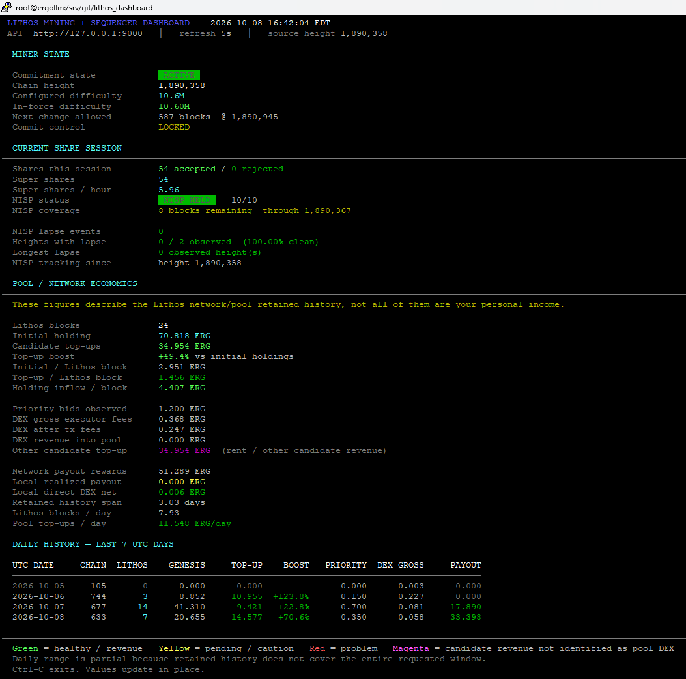

# Lithos Dashboard

A lightweight terminal dashboard for monitoring a
[Lithos Protocol](https://github.com/Lithos-Protocol/Lithos-Client)
miner, sequencer, and decentralized Ergo mining pool participant.

Designed and tested on Linux with Lithos Client v1.0.2.



## Features

- Live Lithos difficulty commitment status
- Commitment activation and lock countdowns
- Accepted/rejected super-share monitoring
- NISP health and remaining coverage
- Persistent NISP lapse and reliability tracking across restarts
- Prominent NISP availability percentage
- Exact rollup-start correlation while NISP is held or unheld
- Estimated miner opportunity cost for rollups encountered while unqualified
- On-chain Lithos network-adoption tracking over 100, 500, and 1,000 blocks
- Implied Lithos hashrate and unique collateral-lender counts
- Pool and network economic statistics
- Lithos block counts
- Initial holding value
- Candidate top-up revenue
- Revenue boost over the Ergo block subsidy
- Priority-bid revenue
- ErgoDEX and LithosDEX executor revenue
- Local realized payout tracking
- 30-day conditional ERG and LIT income projections from local paid and open claims
- Separate confirmed mining rewards, priced pending claims, and unpriced holdings
- Local direct DEX executor income
- Daily historical revenue table
- ANSI color-coded terminal display
- Responsive two-column layout on wide terminals (140+ columns)
- No third-party Python dependencies

## Requirements

- Python 3
- Lithos Client HTTP API
- Ergo node REST API for network-adoption scanning
- ANSI-compatible terminal

The dashboard uses only Python's standard library.

## Installation

Clone the repository:

```bash
git clone https://github.com/arcadiancomp/lithos_dashboard.git
cd lithos_dashboard
```

Install globally:

```bash
install -m 755 lithos_dashboard /usr/local/sbin/lithos_dashboard
```

## Usage

Run with defaults:

```bash
lithos_dashboard
```

The default Lithos API endpoint is:

```text
http://127.0.0.1:9000
```

The dashboard refreshes every 15 seconds and displays seven days of history.

Faster refresh:

```bash
lithos_dashboard --interval 5
```

Longer history:

```bash
lithos_dashboard --days 14
```

Render once:

```bash
lithos_dashboard --once
```

Show version:

```bash
lithos_dashboard --version
```

Remote API:

```bash
lithos_dashboard --url http://192.168.1.10:9000
```

Use a different Ergo node API:

```bash
lithos_dashboard --node-url http://192.168.1.10:9053
```

Disable chain adoption scanning:

```bash
lithos_dashboard --no-adoption
```

Disable ANSI colors:

```bash
lithos_dashboard --no-color
```

### Responsive terminal layout

Starting with v0.1.3, the dashboard automatically uses a compact two-column
layout when the terminal is at least 140 columns wide. This makes better use
of horizontal space and substantially reduces the number of terminal rows
needed on common 1920x1080 displays.

Narrower terminals keep the original stacked layout automatically.

NISP reliability history is persisted under the user's XDG state directory
(default: `~/.local/state/lithos_dashboard/nisp_history.json`).

Reset the NISP reliability counters:

```bash
lithos_dashboard --reset-nisp-history
```

### NISP opportunity tracking

The dashboard stores the NISP state observed at each rollup-start height and
correlates those heights with confirmed Lithos genesis records from `/stats`.
This allows it to count actual Lithos rollups encountered while the local miner
was NISP-qualified or unqualified.

Heights missed while the dashboard is offline are never guessed.

`Missed initial pool value` is the exact initial holding value of rollups seen
at an observed unqualified height. It is pool value, not the local miner's
personal loss.

`Est. miner reward missed` is deliberately labeled as an estimate. It uses the
current in-force commitment score together with the average reward and total
score of retained mature rollups. Actual missed rewards can differ as miner
participation, top-ups, and rollup value change.

The exact rollup correlation starts with v0.1.1 because earlier state files did
not retain per-height NISP observations. Existing aggregate lapse counters are
preserved during the upgrade.

## Network adoption

Starting with v0.1.2, the dashboard can identify Lithos-mined Ergo blocks
directly from the canonical chain instead of relying on pool labels.

The detector learns the current Lithos Holding ErgoTree from a confirmed
genesis transaction and classifies a block as Lithos only when:

- transaction output zero uses that Holding contract, and
- the rollup NFT at output zero is minted from input zero's collateral box ID.

The dashboard reports rolling 100-, 500-, and 1,000-block Lithos shares,
the number of distinct collateral-lender keys, and an implied Lithos
hashrate using the Ergo network hashrate reported for the current difficulty
epoch.

The first run scans up to 1,000 blocks and can take several seconds. Results
are cached in:

```text
~/.local/state/lithos_dashboard/adoption_history.json
```

Later refreshes reuse canonical block IDs and fetch full transaction data only
for new or reorged blocks.

Because a Lithos block's Ergo coinbase is paid to the selected collateral
lender, the address credited as the Ergo block miner can rotate from one
Lithos block to another. The genesis transaction is therefore the reliable
protocol fingerprint.

The Ergo node should have its extra index enabled so historical transaction
lookups are available.

## Projected monthly mining income (v0.1.4)

The income panel uses the client's own `/stats/mining/payments` ledger and the
retained local NISP submission count. It never treats network-wide rewards or
refunded submission bonds as your personal earnings.

- **Typical ERG / 30d:** local submissions per retained day, scaled to 30 days,
  multiplied by the **median** reward among confirmed payouts and priced
  evaluation/payout claims. Median avoids allowing a single unusually large
  unfinalized claim to dominate the baseline.
- **All claims ERG / 30d:** uses the **mean** of the same rewards, including
  unusual projected claims. This is an alternate scenario, not an upper bound.
- **LIT / 30d:** uses the median **confirmed** LIT reward per payout only;
  each raw LIT amount has nine decimal places. No LIT-to-USD conversion.
- **Confirmed:** cumulative local ERG reward and surplus, plus local LIT reward;
  excludes returned ERG bonds.
- **Pending:** sums evaluation/payout-phase ERG claims, with provisional values
  potentially changing through fraud-proof evaluation. Holding claims are
  counted but not priced. Slashed claims are not included in projected rewards.

The claim rate is based on retained local NISP submissions, which can span
multiple commitment settings. The model is conditional, not a guarantee, and
is especially uncertain with only a few mature payouts. It excludes electricity,
transaction fees, slashing losses, direct DEX fees and speculative LIT prices.

## Economics

The dashboard deliberately distinguishes **network/pool economics** from
**local miner income**.

Important figures include:

- `Initial holding` — ERG initially placed into Lithos holding boxes.
- `Candidate top-ups` — additional ERG captured by block candidate sources.
- `Top-up boost` — candidate revenue relative to initial holding value.
- `Holding inflow / block` — initial holding plus candidate top-ups per Lithos block.
- `DEX revenue into pool` — DEX execution proceeds captured inside Lithos candidates.
- `Local direct DEX net` — Executor revenue earned directly by this client.
- `Local realized payout` — confirmed payout rewards attributed to the local miner.

Network and pool totals are not necessarily income belonging solely to the
local miner.

## Lithos sequencing

Lithos allows miners to build economically optimized block candidates rather
than merely supplying hashpower to a centralized pool.

Candidate revenue may include:

- ErgoDEX execution
- LithosDEX execution
- storage-rent collection
- collateral priority bids
- rollup transactions
- emission and collateral queue operations
- future arbitrage and other candidate-capital sources

Lithos Dashboard makes these economics visible in real time.

## Security

The dashboard performs read-only HTTP GET requests against the Lithos API
and, when network-adoption tracking is enabled, the Ergo node API.

It does not require a wallet password, Ergo node API key, Lithos API key,
seed phrase, or private key.

Keeping the Lithos HTTP API bound to `127.0.0.1` is recommended for local
installations.

v0.1.1 also hardens API handling by:

- accepting only `http://` and `https://` API base URLs
- rejecting embedded URL credentials, query strings, and fragments
- stripping terminal control characters from API-provided strings
- limiting each API response to 2 MiB before JSON parsing

## License

MIT

## Author

Arcadian Computers, LLC
